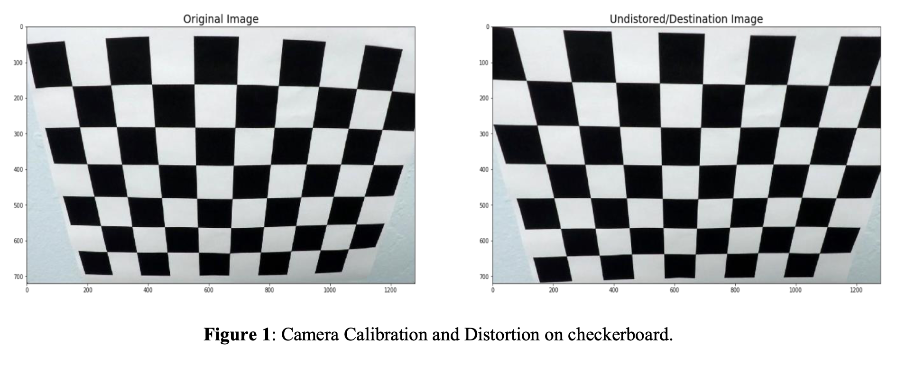
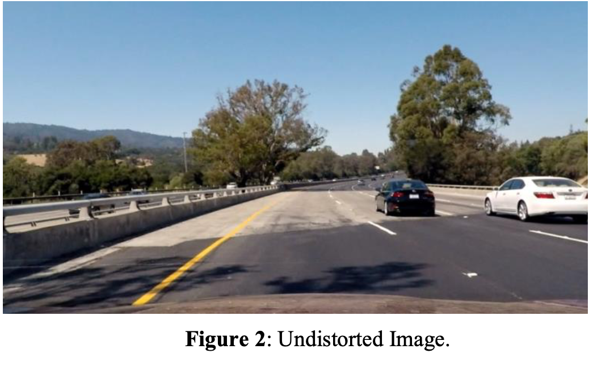
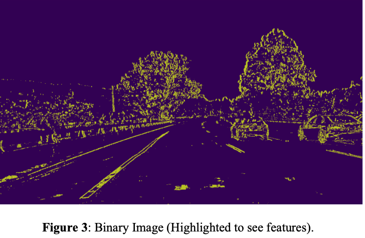
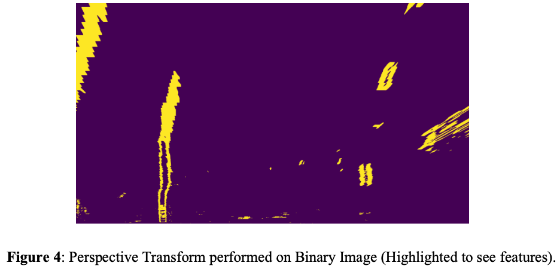
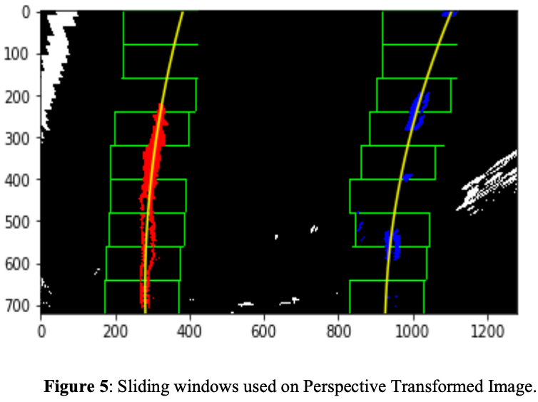
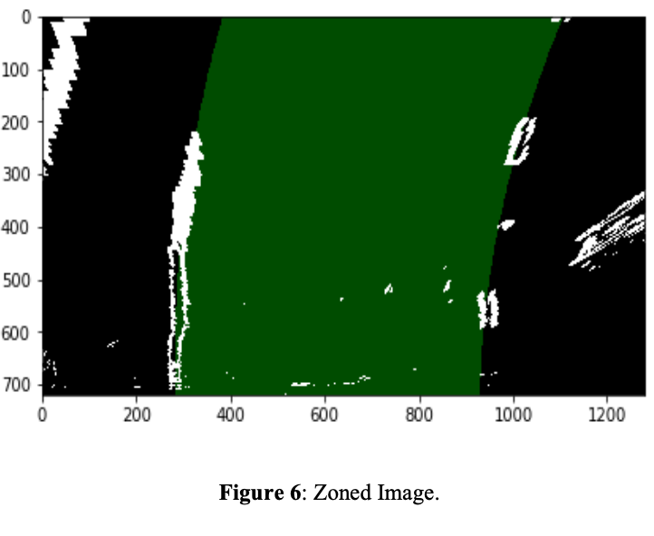
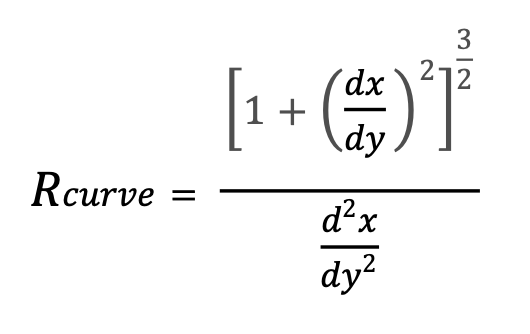
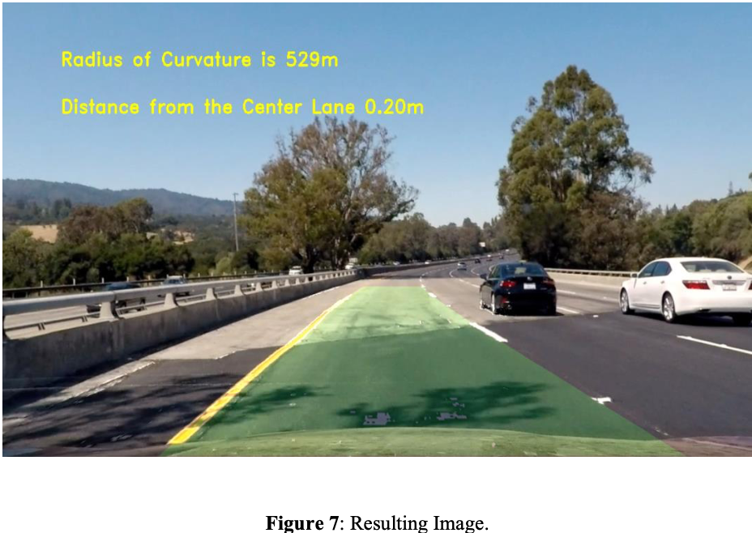

# Advanced Lane Finding


The goals / steps of this project are the following:

-  Compute the camera calibration matrix and distortion coefficients given a set of chessboard images.
- Apply a distortion correction to raw images.
- Use color transforms, gradients, etc., to create a thresholded binary image.
- Apply a perspective transform to rectify binary image ("birds-eye view").
- Detect lane pixels and fit to find the lane boundary.
- Determine the curvature of the lane and vehicle position with respect to center.
- Warp the detected lane boundaries back onto the original image.

## Camera Calibration

In order to account for radial distortion, calibrating the camera was performed on several 9x6 checkerboard images provided by the camera used to take the test image. Using the functions cv2.findChessboardCorners(), cv2.drawChessboardCorners() and cv2.calibrateCamera() along with object points, the camera matrix and distortion coefficients were calculated. These outputs were used to distort any image taken by the camera.



## Pipeline

The following image displays is the result of a distortion-corrected image and what will be the first step in the pipeline:



Unlike the canny algorithm, which may often remove key details about the surroundings, a new algorithm was used to account the change in the color spaces and change in pixel gradient. The function binaryThreshold() which takes in an undistorted image, the color thresholds (145,255) and gradient threshold (25,135) then returns a binary image as seen below. Furthermore, the saturation color channel in the HLS color space was used to identify change in color and the sobel operator was used to highlight pixel gradients in the forward direction.



To perform a perspective, transform such to view the lane lines from a bird’s eye view, four points must framed as the base of the transform. The source points, which highlight points in the from the non- transformed image, were defined as followed.

```bash
src = np.float32([[150, binary_img.shape[0]],[1250, binary_img.shape[0]], [590,450] , [700,450]])
```

On the other hand, the destination points highlight where each respective source point should translate to.

```bash
dest = np.float32([[200, binary_img.shape[0]],[980, binary_img.shape[0]], [200,0] , [980,0]])
```

After the points were defined, they were fed into the function perspectiveTrasnform() which took in the binary image, the source and destination points to return a bird’s eye view photo. To elaborate the functions cv2.warpPerspective and cv2.getPerspectiveTransform were used to perform these linear transformations.



The lane-line pixels were identified and fit to their positions in the function histogramPeak() which took in various parameters and the bird’s eye view image. Essentially, a sliding window algorithm was performed to fit two second degree polynomials as the left lane and the right lane. The function then returned in a zoned image where the two polynomial lines served the borders for a filled section (marking the lane).




The next image shows the lane marking created using cv2.fillPoly() and what is returned from the function.



The radius of the curvature was calculated using the following equation:



```bash
# Implement the calculation of the left line here
left_curverad_cr = ((1+(2*left_fit_cr[0]*y_eval*ym_per_pix + left_fit_cr[1])**2)**(3/2))/(2*left_fit_cr[0]) 
# Implement the calculation of the right line here
right_curverad_cr = ((1+(2*right_fit_cr[0]*y_eval*ym_per_pix+ right_fit_cr[1])**2)**(3/2))/(2*right_fit_cr[0]) 
```

The code was used to calculate the curvature for each lane line and then the average was returned in the function calculateCurvatureRadius(). The position with respect to the center was also calculated by using the center of the image as the car’s position and the middle of the lane zone as the reference for the center of the lane. The difference was taken and returned in the same function as distancefromCenter. It is important to note that 1 pixel is 3.7/700 of a meter in the x-direction.


# Final Output

The zone image was reverted back to standard viewing and applied to the original image.




## Possible Improvements

My algorithm was overall solid enough to handle the sample video and images. When the pipeline was subjected to the challenge video, it seemed to struggle. The conditions were no longer as constant as the sample video and images, such that the noises caused the lane zone to distort. The project
could be improved by writing another algorithm which would be used to fit to the environment. (i.e source points and thresholds)